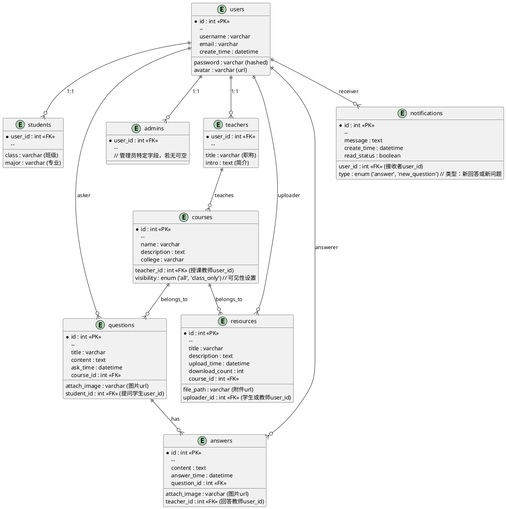

```plantuml
@startuml
entity "users" {
* id : int <<PK>>
  --
  username : varchar
  password : varchar (hashed)
  email : varchar
  avatar : varchar (url)
  create_time : datetime
  }

entity "students" {
* user_id : int <<FK>>
  --
  class : varchar (班级)
  major : varchar (专业)
  }

entity "teachers" {
* user_id : int <<FK>>
  --
  title : varchar (职称)
  intro : text (简介)
  }

entity "admins" {
* user_id : int <<FK>>
  --
  // 管理员特定字段，若无可空
  }

entity "courses" {
* id : int <<PK>>
  --
  name : varchar
  description : text
  college : varchar
  teacher_id : int <<FK>> (授课教师user_id)
  visibility : enum ('all', 'class_only') // 可见性设置
  }

entity "resources" {
* id : int <<PK>>
  --
  title : varchar
  description : text
  file_path : varchar (附件url)
  upload_time : datetime
  download_count : int
  uploader_id : int <<FK>> (学生或教师user_id)
  course_id : int <<FK>>
  }

entity "questions" {
* id : int <<PK>>
  --
  title : varchar
  content : text
  attach_image : varchar (图片url)
  ask_time : datetime
  student_id : int <<FK>> (提问学生user_id)
  course_id : int <<FK>>
  }

entity "answers" {
* id : int <<PK>>
  --
  content : text
  attach_image : varchar (图片url)
  answer_time : datetime
  teacher_id : int <<FK>> (回答教师user_id)
  question_id : int <<FK>>
  }

entity "notifications" {
* id : int <<PK>>
  --
  message : text
  create_time : datetime
  user_id : int <<FK>> (接收者user_id)
  type : enum ('answer', 'new_question') // 类型：新回答或新问题
  read_status : boolean
  }

users ||--o{ students : "1:1"
users ||--o{ teachers : "1:1"
users ||--o{ admins : "1:1"
users ||--o{ resources : "uploader"
users ||--o{ questions : "asker"
users ||--o{ answers : "answerer"
users ||--o{ notifications : "receiver"
courses ||--o{ resources : "belongs_to"
courses ||--o{ questions : "belongs_to"
questions ||--o{ answers : "has"
teachers ||--o{ courses : "teaches"
@enduml
```